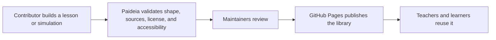

# Paideia

Paideia is an open library for academic simulations and lesson materials.

The simple idea: if someone can design a useful simulation, diagram, lesson, or
teacher note, Paideia should make it easy to publish, review, improve, and reuse.

You do not need to understand the whole codebase to contribute. You can submit a
small lesson pack, a standalone HTML simulation, a React simulation, an external
embed, source corrections, screenshots, or review notes. The repository keeps
the work versioned; GitHub Pages publishes the public library.



## What You Can Contribute

| Contribution | Good for | Minimum files |
| --- | --- | --- |
| Lesson pack | A clear explanation, worked example, or teacher-ready activity | `manifest.yaml`, `lesson.md`, `sources.md`, `license.md` |
| Standalone simulation | Sim made in ChatGPT, Claude, Gemini Canvas, p5.js, vanilla JS, or similar | `manifest.yaml`, `simulation.html`, `lesson.md`, `sources.md`, `license.md` |
| Advanced simulation | React, TypeScript, Three.js, or reusable code | `manifest.yaml`, `simulation/`, `lesson.md`, `sources.md`, `license.md` |
| External embed | Existing friendly-licensed interactive hosted elsewhere | `manifest.yaml`, `lesson.md`, `sources.md`, `license.md` |
| Full Paideia container | Product-quality vertical slice with tests and generated shell routing | Current `a-level/`, `sutd/`, or `shared/` container shape |

Start with [the contribution package guide](docs/public/contribution-packages.md).

## The Simple Folder Shape

Most people should start here:

```text
contributions/
  physics/
    projectile-motion-lab/
      manifest.yaml
      lesson.md
      simulation.html
      preview.png
      sources.md
      teacher-notes.md
      license.md
```

This is intentionally simpler than the current internal container system. The
goal is to let teachers, students, researchers, and AI-assisted builders
contribute useful academic material without learning the whole monorepo.

## Quality Bar

Every accepted contribution should be:

| Requirement | What it means |
| --- | --- |
| Interactive when it claims to be a simulation | Learners can manipulate something and see a visual change. |
| Visual | Simulations should show graphs, diagrams, motion, plots, maps, canvases, or equivalent models. Text-only simulations are not enough. |
| Sourced | Claims, equations, datasets, and adapted ideas cite sources in `sources.md`. |
| License-friendly | Code is MIT-compatible unless isolated and documented. Content is CC-BY-4.0 compatible under the current repo license. |
| Student-facing | Visible copy avoids raw package names, queue IDs, and code terminology. |
| Formula-clear | Where formulas matter, show the formula, substitution, units, result, and legend. |
| Accessible enough to review | Keyboard path, readable labels, and no obvious serious accessibility issues. |

Quality levels are explicit:

| Level | Meaning |
| --- | --- |
| Draft | Shape is valid and the idea can be reviewed. |
| Reviewed | Runs, cites sources, and is usable by a learner or teacher. |
| Featured | Strong pedagogy, polished interaction, good visuals, and clear teacher support. |

## How To Start

### I Have No Code Experience

Open an issue with the concept, audience, and what students usually find
confusing. You can also review a lesson, check sources, suggest diagrams, or
write teacher notes.

Use the [simulation idea issue template](.github/ISSUE_TEMPLATE/sim-idea.md).

### I Made A Simulation With ChatGPT, Claude, Or Gemini

Use the simple package format:

1. Copy `contributions/_template/`.
2. Put your simulation in `simulation.html`.
3. Fill in `manifest.yaml`.
4. Add sources and license notes.
5. Open a pull request.

Use [AI simulation prompts](docs/public/ai-simulation-prompts.md) to generate a
package that is easier to review.

### I Want To Use Codex Or Claude Code

Use the advanced prompt in [AI simulation prompts](docs/public/ai-simulation-prompts.md).
It tells coding agents how to create one contribution package without crawling
the whole repo.

### I Want To Build A Full Paideia Container

Use [Agent workflows](docs/agent-workflows.md) and
[Container specification](docs/container-spec.md). This is the heavier path for
featured curriculum slices that need tests, generated routes, and shared
kernels.

## Hosting Direction

The default deployment target is GitHub Pages:

- static lesson pages;
- client-side simulations;
- searchable gallery;
- no accounts required;
- every change reviewed through pull requests.

Railway or another backend only becomes necessary later if Paideia needs
accounts, private drafts, upload forms, moderation queues, analytics, or
server-side AI generation.

## Repository Map

| Path | Purpose |
| --- | --- |
| `contributions/` | Simple contributed lesson/simulation packages. |
| `a-level/` | Current A-Level curriculum containers. |
| `sutd/` | Current SUTD curriculum containers. |
| `shared/` | Cross-curriculum containers. |
| `core/` | Reusable kernels, schemas, charting, plotting, and simulation runtime pieces. |
| `testing/sim-harness/` | Direct browser harness for all registered simulations. |
| `docs/public/` | Human-friendly contributor docs. |
| `docs/quality/` | Quality standards, audits, and exemplar gallery. |
| `docs/agents/` | Agent-specific runbooks for Codex and Claude Code. |

## For Developers

```bash
pnpm install
pnpm test
pnpm container:validate
pnpm graph:check
pnpm agent:validate
```

Common checks:

| Task | Command or guide |
| --- | --- |
| Validate current containers | `pnpm container:validate` |
| Check visual simulation contracts | `pnpm container:visual-quality` |
| Check generated shell data | `pnpm graph:check` |
| Run accessibility smoke tests | `pnpm test:a11y` |
| Build the static Pages artifact | `pnpm build:pages` |
| Build a full container | [Agent workflows](docs/agent-workflows.md) |
| Understand contribution packages | [Contribution package guide](docs/public/contribution-packages.md) |

## Safety And Licensing

These rules keep the library useful and legally safe:

| Rule | Why it matters |
| --- | --- |
| Cite sources | Teachers and learners need to verify claims. |
| Do not paste textbook chapters | Explain in your own words and cite instead. |
| Do not include private student data | Use fictional, synthetic, or public data only. |
| Do not copy proprietary or GPL simulation code | Keep the public site easy to reuse and deploy. |
| Record AI assistance | AI can help draft or code, but the contribution still needs human review. |

Current licenses:

- Code: [MIT](LICENSE)
- Learning content: [CC-BY-4.0](LICENSE-content)
- Third-party notices: [NOTICE](NOTICE)

The future licensing direction may move to Apache-2.0 for code and CC-BY-SA-4.0
for content, but the current license files remain authoritative until a
dedicated migration lands.

## Project Docs

- [Contribution package guide](docs/public/contribution-packages.md)
- [AI simulation prompts](docs/public/ai-simulation-prompts.md)
- [Mission and governance](docs/README.md)
- [Container specification](docs/container-spec.md)
- [Visual simulation standard](docs/quality/visual-simulation-standard.md)
- [Visual exemplar gallery](docs/quality/visual-exemplar-gallery.md)
- [Agent workflows](docs/agent-workflows.md)
- [Hosting and licensing plan](docs/product/hosting-and-licensing.md)
