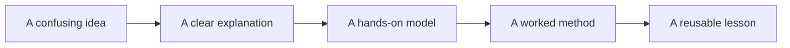
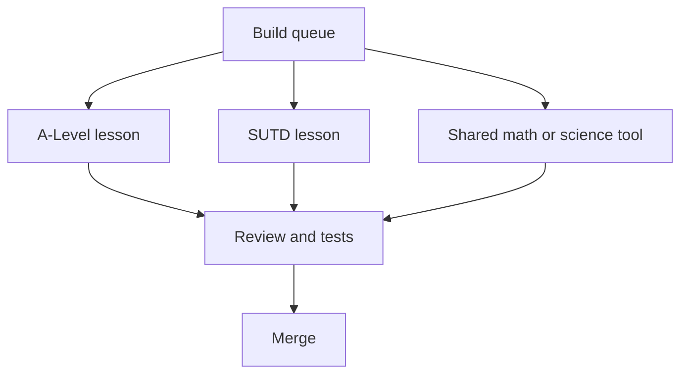

# Paideia

Paideia is a public project for building better learning tools.

The goal is simple: take difficult ideas, turn them into small interactive
lessons, and make those lessons easy for teachers, students, and contributors
to improve.

You do not need to be a software engineer to help. If you can spot a confusing
topic, explain how a student gets stuck, check a source, sketch a better
diagram, or test a lesson, you can contribute.

## What This Project Builds

Each lesson focuses on one idea.

For example, a lesson on motion might include:

| Part | What the learner sees |
| --- | --- |
| Clear explanation | The idea in plain language, then the formal definition |
| Interactive model | Sliders, diagrams, motion, graphs, or decisions the learner can change |
| Prediction step | A question before the answer is revealed |
| Worked method | The formula, substitution, units, and reasoning used |
| Common mistakes | The wrong turns students often take, shown directly |
| Connections | What the idea depends on and what it unlocks next |



## How You Can Help

| If this sounds like you | Start here |
| --- | --- |
| "I found a topic students struggle with." | Use the [sim idea issue template](.github/ISSUE_TEMPLATE/sim-idea.md). |
| "I can explain this better." | Read [Contributing](CONTRIBUTING.md), then suggest a concept-card improvement. |
| "I want an AI coding agent to help me." | Use the copy-paste prompts in [Agent workflows](docs/agent-workflows.md). |
| "I want to build a full lesson." | Follow [Build one lesson](docs/agent-workflows.md#prompt-build-one-lesson). |
| "I want to check quality." | Start with [review-container](.agents/skills/review-container/SKILL.md): sources, wording, accessibility, and whether the lesson actually teaches. |

If you are not sure where to begin, start with the public onboarding brief:
[Contributing without a coding background](docs/public/cfe-onboarding.html).

## What Is Ready Now

The first working path is A-Level Physics. It already has reviewed interactive
lessons for:

| Area | Status |
| --- | --- |
| Physical quantities and units | Reviewed |
| Scalars and vectors | Reviewed |
| Resolving vectors | Reviewed |
| Kinematics in one dimension | Reviewed |

The next recommended lesson is **forces and equilibrium**, because it builds
directly on the motion and vector lessons.

## How The Work Scales

Paideia can grow in parallel when each team or agent owns one small lesson at a
time and the shared checks stay green.



Parallel work is safe when:

| Needed before a large wave | Current state |
| --- | --- |
| A clear build queue | Started in [container-build-queue.yaml](docs/product/container-build-queue.yaml) |
| One lesson per pull request | Working well |
| Shared tools for repeated math and simulations | Many core tools exist, more will be added as needed |
| Tests that catch broken lessons | In place for the current A-Level shell |
| Simple instructions for humans and AI agents | This README and [Agent workflows](docs/agent-workflows.md) are the entrypoints |

That means we can already run several focused builds at the same time. For a
large SUTD-wide wave, the next step is to seed the SUTD build queue and shell
with the first concepts for EPD, CSD, ESD, ASD, and Freshmore before assigning
many agents.

## For AI Coding Agents

Agents should not crawl the whole repository.

Use this order:

1. Read [AGENTS.md](AGENTS.md) for the short project rules.
2. Read [Agent workflows](docs/agent-workflows.md) for the exact prompt type.
3. Read only the files named by that prompt.
4. Work on one target.
5. Run the listed checks before opening a pull request.

The agent folders have different purposes:

| Folder | Purpose |
| --- | --- |
| `.agents/skills/` | Main reusable skills for agent workflows |
| `.claude/skills/` | Mirror of the same skills for Claude Code |
| `.codex/agents/` | Codex reviewer role definitions |
| `.claude/agents/` | Claude reviewer role definitions |
| `.cursor/rules/` | Cursor editor rules |

The single human-readable map is [docs/agent-workflows.md](docs/agent-workflows.md).
Run `pnpm agent:validate` to check that the agent instructions stay consistent.

## Safety Rules

These rules keep the project useful and legally simple:

| Rule | Why it matters |
| --- | --- |
| Cite sources | Learners and teachers need to check where claims came from. |
| Do not paste textbook chapters | Summarize, explain, and cite instead of copying. |
| Do not include private student data | Build examples with fictional or public data only. |
| Do not copy incompatible code | Avoid GPL, AGPL, LGPL, proprietary, or unclear simulation code in the product. |
| Keep AI in the assistant role | AI can draft, test, and critique; humans remain responsible for the lesson. |

## For Developers

```bash
pnpm install
pnpm test
pnpm container:validate
pnpm graph:check
pnpm agent:validate
```

Common tasks:

| Task | Command or guide |
| --- | --- |
| Add a lesson | `pnpm container:new` |
| Validate lessons | `pnpm container:validate` |
| Regenerate lesson docs | `pnpm container:docs <container-path>` |
| Check generated lesson graph | `pnpm graph:check` |
| Follow the build roadmap | [Container roadmap](docs/product/container-roadmap.md) |

## Project Docs

- [Mission and governance](docs/README.md)
- [Agent workflows](docs/agent-workflows.md)
- [Container specification](docs/container-spec.md)
- [Product roadmap](docs/product/container-roadmap.md)
- [Core module inventory](docs/core-modules.md)
- [GitHub setup](docs/github-setup.md)
- [Clean-room dependency guide](docs/dependency-clean-room.md)

## License

- Code: [MIT](LICENSE)
- Learning content: [CC-BY-4.0](LICENSE-content)
- Third-party notices: [NOTICE](NOTICE)
