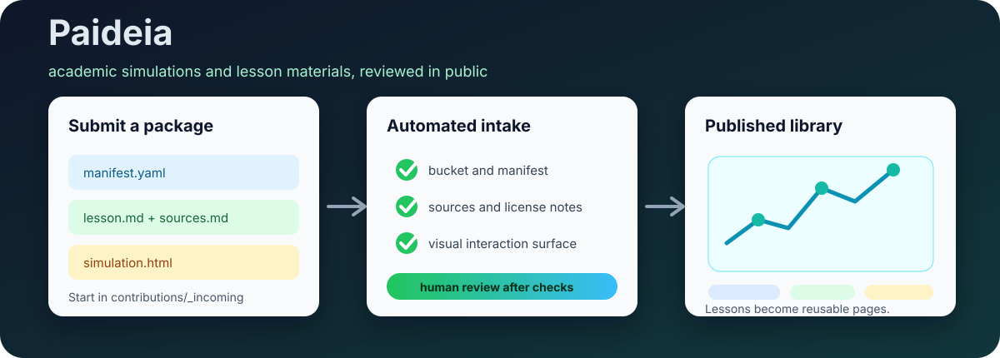

# Paideia

Paideia is a simple public library for academic mini-apps, simulations, and
lesson materials.

The whole active architecture is:

```text
people submit folders -> checks run -> GitHub Pages lists the folders
```

No curriculum engine. No core-kernel system. No generated knowledge graph.



## Start Here

| I want to... | Go here |
| --- | --- |
| Try the public site | [Paideia on GitHub Pages](https://anieyrudh.github.io/Paideia/) |
| Submit a lesson or simulation idea | [Contribution package issue](.github/ISSUE_TEMPLATE/contribution-package.md) |
| Copy the package template | [`contributions/_template`](contributions/_template) |
| Build with ChatGPT, Claude, or Gemini | [AI simulation prompts](docs/public/ai-simulation-prompts.md) |
| Understand the checks | [Automated contribution intake](docs/public/contribution-intake-workflow.md) |

## What This Repository Is Now

Paideia is a folder-based collection.

Each contribution is one folder:

```text
contributions/
  physics/
    projectile-motion/
      manifest.yaml
      lesson.md
      simulation.html
      sources.md
      license.md
```

GitHub Actions checks the folder. GitHub Pages lists it.

That is the product.

## What You Can Submit

| Submission | Required files |
| --- | --- |
| Lesson only | `manifest.yaml`, `lesson.md`, `sources.md`, `license.md` |
| Interactive simulation | `manifest.yaml`, `lesson.md`, `simulation.html`, `sources.md`, `license.md` |
| External demo or embed | `manifest.yaml`, `lesson.md`, `sources.md`, `license.md` |
| Teacher notes | Add `teacher-notes.md` to any package |
| Preview image | Add `preview.png` to any package |

If you are unsure where the package belongs, start here:

```text
contributions/
  _incoming/
    my-topic/
      manifest.yaml
      lesson.md
      simulation.html
      sources.md
      license.md
```

Then run:

```bash
pnpm contribution:organize -- --write
pnpm contribution:validate
```

## What The Checks Do

The automated checks are deliberately small:

| Check | What it verifies |
| --- | --- |
| Folder shape | Required files exist. |
| Manifest | Title, slug, subject, level, type, status, and license fields are present. |
| Sources | `sources.md` has real citations. |
| License | `license.md` is filled and obvious GPL/proprietary blockers are stopped. |
| Simulation | If a package claims to be a simulation, `simulation.html` exists and has a visible interactive surface. |
| Gallery | `pnpm build:pages` can render the static site. |

The checks do not certify that a lesson is correct. They only make the review
process cleaner.

## Local Commands

```bash
pnpm install
pnpm contribution:organize -- --check
pnpm contribution:validate
pnpm build:pages
pnpm test
```

`pnpm test` is intentionally small. It runs the contribution organization and
validation checks.

## Repository Map

| Path | Purpose |
| --- | --- |
| `contributions/` | Active lesson and simulation packages. |
| `contributions/_template/` | Copy this to start a new package. |
| `contributions/_incoming/` | Temporary landing zone for unsure contributors. |
| `docs/public/` | Human-friendly contributor docs. |
| `scripts/build-pages.mjs` | Builds the static GitHub Pages gallery. |
| `scripts/organize-contributions.mjs` | Moves packages into `contributions/<subject>/<slug>/`. |
| `scripts/validate-contributions.mjs` | Validates package shape, sources, license notes, and basic simulation presence. |
| `archive/legacy-curriculum-system/` | Previous complex Paideia monorepo experiment, kept for reference only. |

## What Was Archived

The previous A-Level/SUTD curriculum containers, shared kernels, generated
graphs, sim harness, and heavy CI workflows are now in:

```text
archive/legacy-curriculum-system/
```

They are not the active project. They are preserved only so useful old examples
can be recovered later.

## Safety And Licensing

These rules keep the library useful and legally safe:

| Rule | Why it matters |
| --- | --- |
| Cite sources | Teachers and learners need to verify claims. |
| Do not paste textbook chapters | Explain in your own words and cite instead. |
| Do not include private student data | Use fictional, synthetic, or public data only. |
| Do not copy proprietary or GPL simulation code | Keep the public site easy to reuse and deploy. |
| Record AI assistance | AI can help draft or code, but the contribution still needs review. |

Current licenses:

- Code: [MIT](LICENSE)
- Learning content: [CC-BY-4.0](LICENSE-content)
- Third-party notices: [NOTICE](NOTICE)

## Useful Docs

- [Contribution package guide](docs/public/contribution-packages.md)
- [Automated contribution intake](docs/public/contribution-intake-workflow.md)
- [AI simulation prompts](docs/public/ai-simulation-prompts.md)
