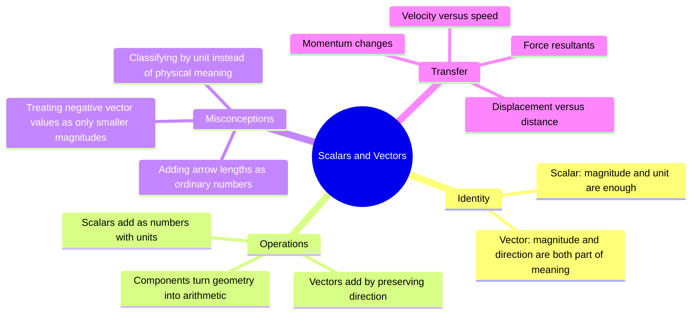

# Scalars and Vectors Mindmap

```mermaid
mindmap
  root((Scalars and Vectors))
    Identity
      Scalar: magnitude and unit are enough
      Vector: magnitude and direction are both part of meaning
    Operations
      Scalars add as numbers with units
      Vectors add by preserving direction
      Components turn geometry into arithmetic
    Misconceptions
      Adding arrow lengths as ordinary numbers
      Treating negative vector values as only smaller magnitudes
      Classifying by unit instead of physical meaning
    Transfer
      Displacement versus distance
      Velocity versus speed
      Force resultants
      Momentum changes
```
