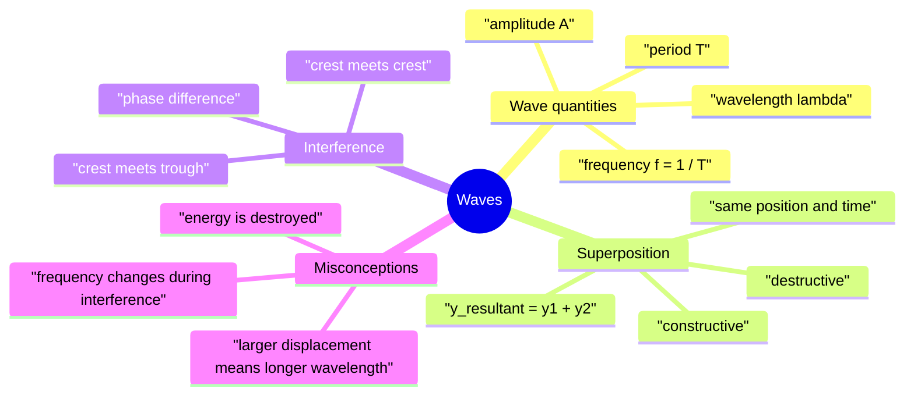

# Waves Mindmap

```mermaid
mindmap
  root((Waves))
    Wave quantities
      "amplitude A"
      "wavelength lambda"
      "period T"
      "frequency f = 1 / T"
    Superposition
      "same position and time"
      "y_resultant = y1 + y2"
      "constructive"
      "destructive"
    Interference
      "phase difference"
      "crest meets crest"
      "crest meets trough"
    Misconceptions
      "larger displacement means longer wavelength"
      "frequency changes during interference"
      "energy is destroyed"
```
