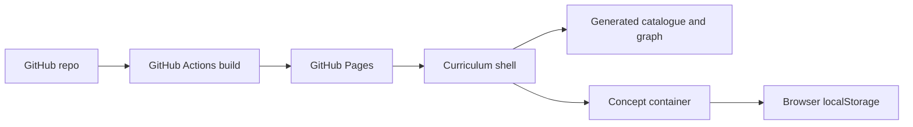

# Hosting And Licensing Plan

This is the planning source for Paideia hosting and license migration. It does
not change the repository's effective license by itself; `LICENSE`,
`LICENSE-content`, package metadata, and contribution terms still define the
current legal state until a dedicated migration PR lands.

## Hosting Decision

Paideia should be **static-first on GitHub Pages**.

The public product should ship as static HTML, CSS, JavaScript, generated app
data, and media. Simulations should run in the browser with client-side
computation. The first learner state model should use local storage rather than
accounts or a database.

GitHub Pages is a good fit because the product is currently:

- public educational content;
- client-side simulations;
- generated curriculum catalogues and knowledge graphs;
- embeddable containers with no required server session;
- open-source by default.

## Static-First Architecture



The browser owns the normal learner loop:

| Concern | Static-first answer |
| --- | --- |
| Catalogue | generated TypeScript/JSON at build time |
| Search | client-side index over generated graph data |
| Sim computation | browser kernels from `core/` packages |
| Prediction checkpoint | local browser storage |
| Progress v0 | local storage |
| Embeds | static host-ready bundle per container |
| Secrets | none in the frontend |

## Automatic Pages Publishing

The GitHub Pages workflow builds one static artifact from every discovered
curriculum shell at `<branch>/apps/shell`.

Current outputs:

| Source app | Published path |
| --- | --- |
| `a-level/apps/shell` | `/a-level/` |
| `sutd/apps/shell` | `/sutd/` |

New product slices do not require deployment edits. A container PR updates the
container files and generated graph data; after merge to `main`, the Pages
workflow rebuilds the shell and the new slice appears in the catalogue.

New curriculum shells are also picked up automatically if they follow the same
path convention:

```text
<branch>/apps/shell/package.json
```

The builder is `pnpm build:pages`, implemented by `scripts/build-pages.mjs`.
It builds each shell with a relative Vite base and writes the deployable
artifact to `dist/pages/`.

## When To Add A Backend

Do not add Railway, Fly, Supabase, or a custom server for the first public
release. Add a backend only when the feature cannot be implemented safely as
static client-side code.

| Need | GitHub Pages | Backend trigger |
| --- | --- | --- |
| Public curriculum shell | Yes | No |
| Static simulations | Yes | No |
| Local learner progress | Yes | No |
| Cross-device progress sync | No | User accounts or sync required |
| Private classes/cohorts | No | Authentication and permissions required |
| Notebook/Python labs | Limited | Server sandbox or worker runtime required |
| AI tutor/API calls | No | Secrets, metering, and abuse controls required |
| Analytics | Limited | Event collection and consent required |
| Large generated media | Maybe | Pages size/bandwidth pressure |

Backend work should preserve container portability. A container should still run
standalone without account state unless its own manifest declares otherwise.

## GitHub Pages Constraints

Design within GitHub Pages' published constraints:

- Pages is static hosting; do not use it for sensitive transactions or secrets.
- Keep the published site below the documented size limits.
- Keep generated media efficient; move large binary assets to releases or a CDN
  only when needed.
- Prefer a custom GitHub Actions Pages workflow so build frequency and app build
  steps are explicit.
- Use a verified custom domain before a broad public launch.

References:

- GitHub Pages docs: https://docs.github.com/en/pages
- GitHub Pages limits: https://docs.github.com/en/pages/getting-started-with-github-pages/github-pages-limits
- GitHub Pages custom workflows: https://docs.github.com/en/pages/getting-started-with-github-pages/using-custom-workflows-with-github-pages

## License Direction

Current state:

| Area | Current license |
| --- | --- |
| Code | MIT |
| Curriculum content | CC-BY-4.0 |
| Runtime dependencies | allowlisted by `LICENSES.json` |

Proposed direction:

| Area | Proposed license | Why |
| --- | --- | --- |
| Code | Apache-2.0 | Keeps permissive reuse while adding an explicit patent grant. |
| Curriculum content | CC-BY-SA-4.0 | Keeps adaptations open under the same content terms. |
| Third-party runtime code | permissive allowlist only | Avoids GPL/AGPL/LGPL workflow complications in browser bundles. |

This direction fits the project goal: human-friendly open education with
agent-friendly engineering, while keeping downstream school and public-interest
reuse practical.

## Migration Steps

Use a dedicated licensing PR before changing the effective license:

1. Confirm the copyright holder and contributor history.
2. Decide whether the new terms apply only prospectively or to the whole
   repository history.
3. Replace `LICENSE` with Apache-2.0 text if the code migration is approved.
4. Replace `LICENSE-content` with CC-BY-SA-4.0 text if the content migration is
   approved.
5. Update `package.json`, `README.md`, `docs/README.md`, `docs/public/`, and
   `NOTICE`.
6. Keep `LICENSES.json.allowed` compatible with the runtime dependency policy.
7. Add an ADR recording the decision and the date it became effective.

References:

- Apache-2.0: https://www.apache.org/licenses/LICENSE-2.0.html
- Applying Apache-2.0: https://www.apache.org/legal/apply-license
- CC-BY-SA-4.0 legal code: https://creativecommons.org/licenses/by-sa/4.0/legalcode

## Non-Goals

- No server dependency for the first public product.
- No user accounts before the local product loop is useful.
- No GPL, AGPL, LGPL, proprietary, or unclear-license simulation code in runtime
  bundles.
- No client-side secret keys.
- No license text changes hidden inside unrelated container PRs.
