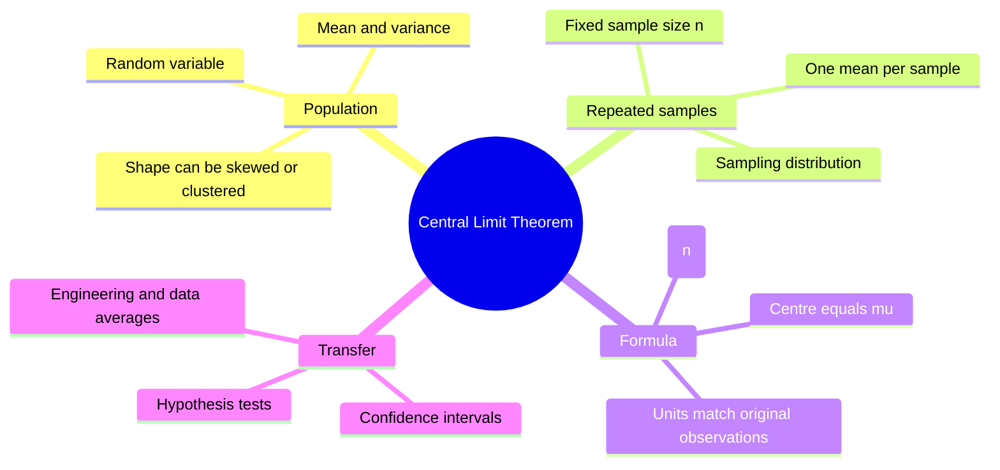

# Central Limit Theorem Mindmap

```mermaid
mindmap
  root((Central Limit Theorem))
    Population
      Random variable
      Mean and variance
      Shape can be skewed or clustered
    Repeated samples
      Fixed sample size n
      One mean per sample
      Sampling distribution
    Formula
      Centre equals mu
      Standard error equals sigma over sqrt(n)
      Units match original observations
    Transfer
      Confidence intervals
      Hypothesis tests
      Engineering and data averages
```
