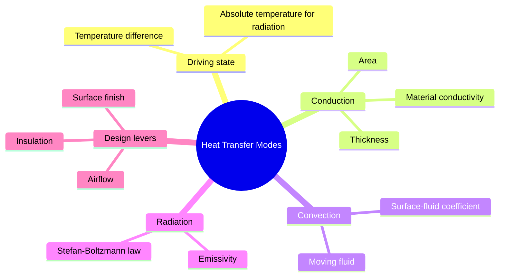

# Heat Transfer Modes Mindmap

```mermaid
mindmap
  root((Heat Transfer Modes))
    Driving state
      Temperature difference
      Absolute temperature for radiation
    Conduction
      Material conductivity
      Area
      Thickness
    Convection
      Surface-fluid coefficient
      Moving fluid
    Radiation
      Emissivity
      Stefan-Boltzmann law
    Design levers
      Insulation
      Airflow
      Surface finish
```
