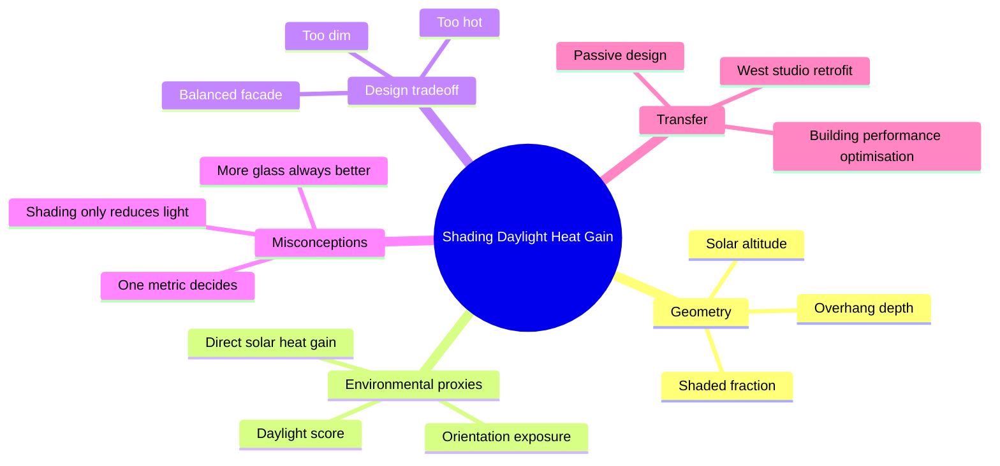

# Shading, Daylight, and Heat Gain Mindmap

```mermaid
mindmap
  root((Shading Daylight Heat Gain))
    Geometry
      Overhang depth
      Solar altitude
      Shaded fraction
    Environmental proxies
      Daylight score
      Direct solar heat gain
      Orientation exposure
    Design tradeoff
      Too hot
      Too dim
      Balanced facade
    Misconceptions
      More glass always better
      Shading only reduces light
      One metric decides
    Transfer
      West studio retrofit
      Passive design
      Building performance optimisation
```
