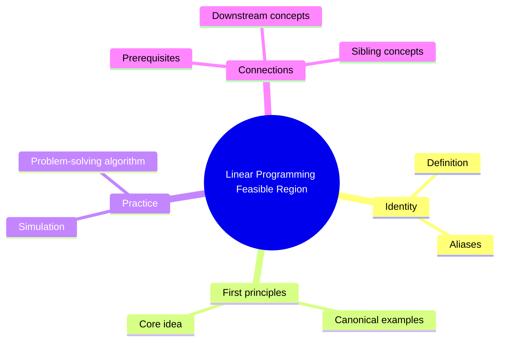

# Linear Programming Feasible Region Mindmap

```mermaid
mindmap
  root((Linear Programming Feasible Region))
    Identity
      Definition
      Aliases
    First principles
      Core idea
      Canonical examples
    Practice
      Simulation
      Problem-solving algorithm
    Connections
      Prerequisites
      Downstream concepts
      Sibling concepts
```
