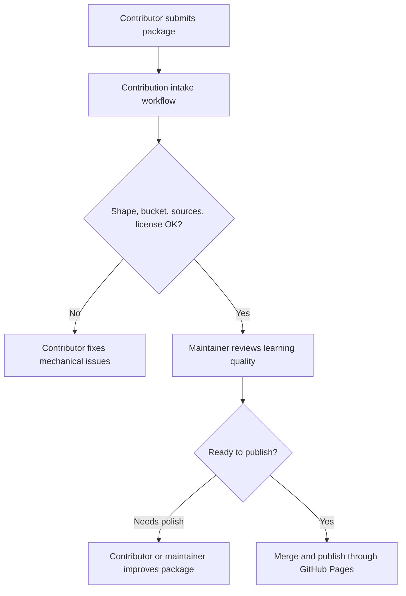

# Automated Contribution Intake

Paideia accepts lightweight academic lessons and simulations through pull
requests. The intake workflow keeps this approachable: contributors can submit a
simple folder, then automation checks the basics before maintainers review the
learning quality.

## What The Automation Checks

| Check | What it catches |
| --- | --- |
| Bucket path | The package lives at `contributions/<subject>/<slug>/`. |
| Manifest shape | Required title, slug, subject, level, type, status, license, and simulation fields are present. |
| Required files | `lesson.md`, `sources.md`, and `license.md` exist and are not placeholders. |
| Simulation surface | Simulation packages include `simulation.html` or `simulation/`, with a visible model and learner interaction. |
| Sources | `sources.md` includes real citations with URLs. |
| License safety | GPL, AGPL, LGPL, proprietary, or unclear runtime material is stopped for maintainer review. |

The workflow runs on pull requests that touch `contributions/`. It reports
issues on the pull request. It does not rewrite untrusted contributor pull
requests directly; contributors, maintainers, or agent helpers apply the safe
mechanical fixes.

## Local Commands

```bash
pnpm contribution:organize -- --check
pnpm contribution:organize -- --write
pnpm contribution:validate
```

Use `--check` to see whether a package is in the right bucket. Use `--write` to
move a package from `contributions/_incoming/<slug>/` to the correct
`contributions/<subject>/<slug>/` folder.

## What Automation Can Fix

Automation can safely handle mechanical organization when run locally or by a
trusted maintainer/agent:

- move a package from `_incoming` to the bucket named by `manifest.subject`;
- check that the folder slug matches `manifest.slug`;
- point out missing files, placeholder text, missing citations, and obvious
  license blockers.

## What Still Needs Human Review

Automation does not certify:

- whether the explanation is pedagogically strong;
- whether the simulation model is scientifically accurate;
- whether the sources are the best sources;
- whether a lesson is culturally or curriculum appropriate;
- whether an AI-generated simulation is elegant enough to feature.

Maintainers should treat the automated checks as the first gate, not the final
judgment.

## Expected Pull Request Flow



## Safe Defaults For Contributors

- Put first drafts in `contributions/_incoming/<slug>/`.
- Use original code or MIT-compatible examples.
- Write original lesson text in your own words.
- Cite every formula, dataset, diagram source, and adapted idea.
- Include a visual simulation surface if the package says it is a simulation.
- Keep everything client-side unless a maintainer approves server-side needs.
