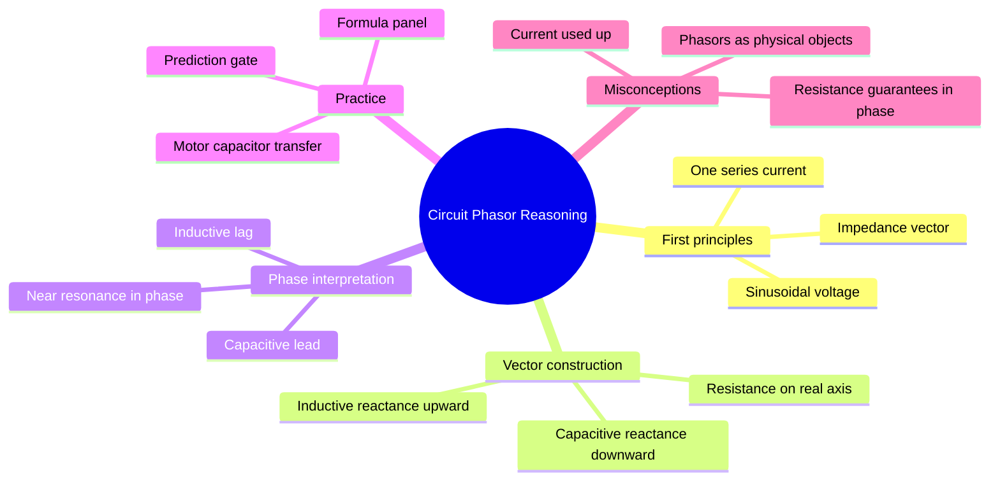

# Circuit Phasor Reasoning Mindmap

```mermaid
mindmap
  root((Circuit Phasor Reasoning))
    First principles
      Sinusoidal voltage
      One series current
      Impedance vector
    Vector construction
      Resistance on real axis
      Inductive reactance upward
      Capacitive reactance downward
    Phase interpretation
      Inductive lag
      Capacitive lead
      Near resonance in phase
    Practice
      Prediction gate
      Formula panel
      Motor capacitor transfer
    Misconceptions
      Phasors as physical objects
      Resistance guarantees in phase
      Current used up
```
